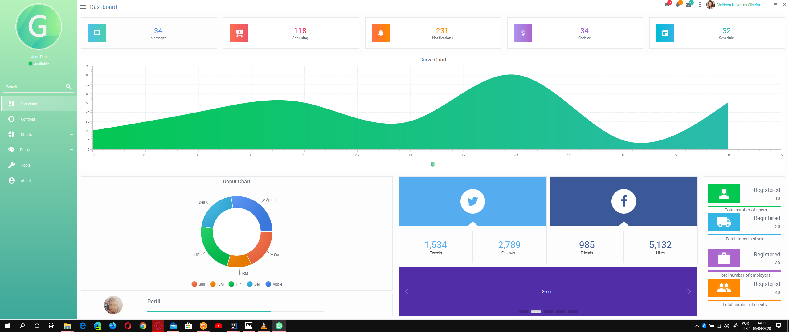

[](http://gleidson28.blogspot.com)

[](https://github.com/Gleidson28/GNCarousel/blob/master/LICENSE) 


<h1></h1>

<p align="center">
  
</p>


<h1></h1>
<h6 align="center"> This project is part of the set of custom components created for JavaFx. </h6>

<h1></h1>
<h6 align="center"> Comming soon. </h6>

* 1  Style Guide. 
* 2  New custom Controls.
* 3  More bootstrap theme.
* 4  New Dashboard Style.
* 5  New Version of Dashboard.
* 6  GridFx (tests).
* 7  New fxml samples.
* 8  Default models.
* 9  JFoenix integration.

<h1></h1>

<h1> DashboardFx </h1>


<h5> This dashboard is a collection of the samples for javafx creators.</h5>

> Find templates, themes, controls, custom uis.

<h1></h1>

<h3> Library Dependency</h3>
<p> Find the dependencies in the lib folder.</p> 

<h1></h1>


<h3> How to use css scheme </h3>

<h4> In the scene </h4>

```java
getScene().getStylesheets().addAll(
    getClass().getResource("/com/gn/theme/css/fonts.css").toExternalForm(), // 1 
    getClass().getResource("/com/gn/theme/css/material-color.css").toExternalForm(), // 2
    getClass().getResource("/com/gn/theme/css/skeleton.css").toExternalForm(), // 3
    getClass().getResource("/com/gn/theme/css/light.css").toExternalForm(), // 4
    getClass().getResource("/com/gn/theme/css/bootstrap.css").toExternalForm(), // 5
    getClass().getResource("/com/gn/theme/css/simple-info.css").toExternalForm(), // 6
    getClass().getResource("/com/gn/theme/css/shape.css").toExternalForm(), // 7
    getClass().getResource("/com/gn/theme/css/typographic.css").toExternalForm(), // 8
    getClass().getResource("/com/gn/theme/css/helpers.css").toExternalForm(), // 9 
    getClass().getResource("/com/gn/theme/css/light-green.css").toExternalForm(), // 10 
    getClass().getResource("/com/gn/theme/css/master.css").toExternalForm() // 11
);
```
* 1  Load fonts to use in a system that not have this font. 
* 2  Contain a multiples colors used in all CSS system.
* 3  This CSS override the default theme (Modena), return the max possible for 0% stylized.
   - This technic is used in web development as reset css.
* 4  Define the lighting theme 
   - For dark theme getClass().getResource("/com/gn/theme/css/dark.css").toExternalForm(),
* 5  Contains util classes. 
   - Ex. btn-default, btn-danger..
* 6  Define the system color used.
    - Ex. The base color used to button is -base.. override color in root.. (.root {-base : blue;}
    - Result in all buttons with color blue;
    - For most details consult wiki page.
* 7  Used to define a system of typographic.
* 8  Used to configure shapes for nodes.
   - rectangle, polygon, circles...
* 9  Additional css for add effects and others.
* 10 Them for ap.
* 11 For you replace.

<h4> Direct FXml </h4>

<p>Don't load the font files direct in the fxml.. can cause instability at the SceneBuilder. The fonts not installed in your system... SceneBuilder does not support load of external fonts. To viewController fonts in your SceneBuilder, the install fonts in your system.</p>
  
```html5
 <stylesheets>
  <URL value="@../../theme/css/material-color.css" />
  <URL value="@../../theme/css/skeleton.css" />
  <URL value="@../../theme/css/light.css" />
  <URL value="@../../theme/css/bootstrap.css" />
  <URL value="@../../theme/css/simple-info.css" />
  <URL value="@../../theme/css/shape.css" />
  <URL value="@../../theme/css/typographic.css" />
  <URL value="@../../theme/css/helpers.css" />
  <URL value="@../../theme/css/master.css" />
  </stylesheets>
```
          
## Preview



